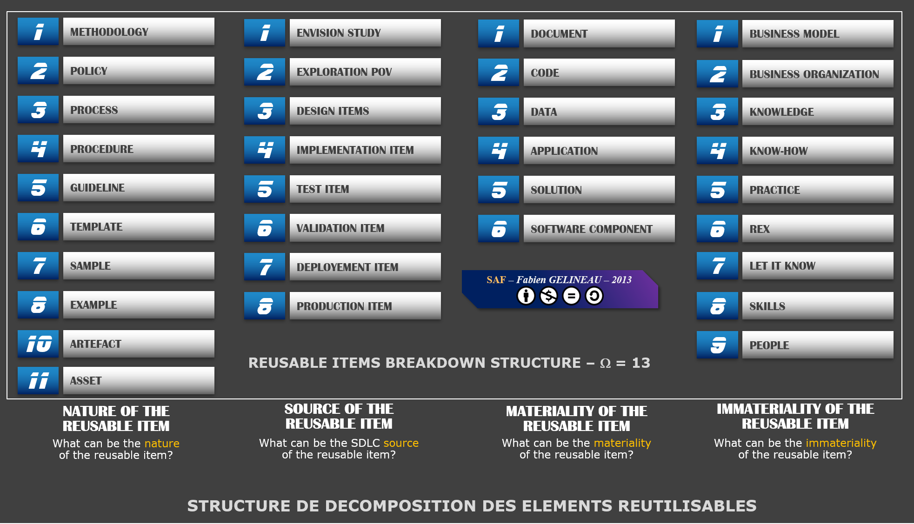

Sublime Architecture Framework, reusable items
================
neonira

One frequently asked question, and very often left open is “What should
I reuse?” and its correlary “What reusable items categorization should I
consider?”.

Generally, each of us had its own idea about this topic, and it ends up
not to be so easy to get to a share view about reuse and reusable items.

# My way

I faced that issue many times, and it is time to share my best practice
about it. I created a ine-slide summary for reusable items, that will
help you consider the problem and solve it. See here under.

# A final word

Fill free to reuse this material. Contact me to know more if needed.
