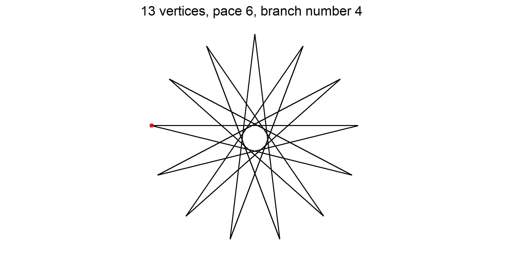
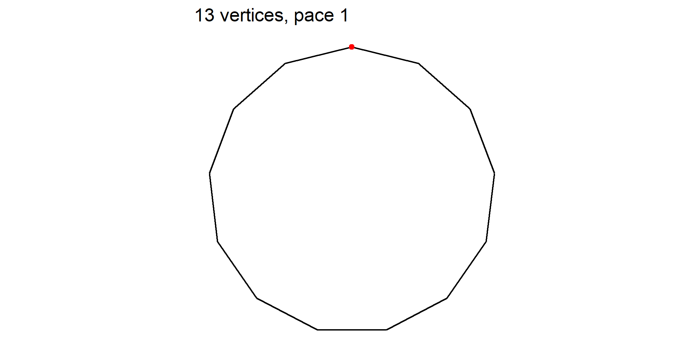
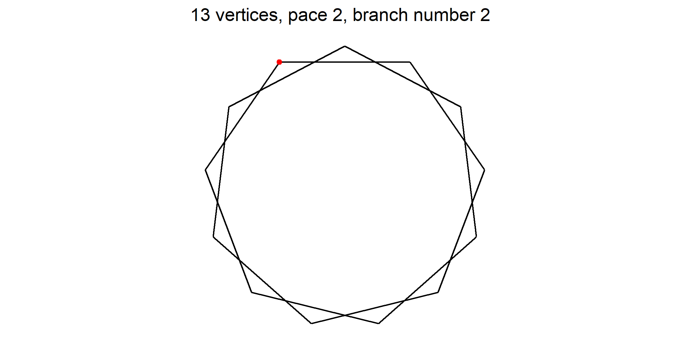
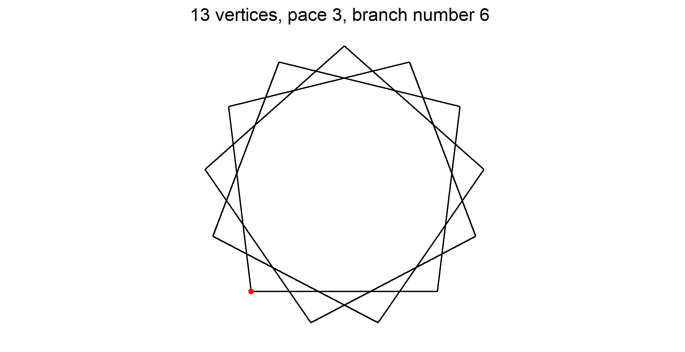
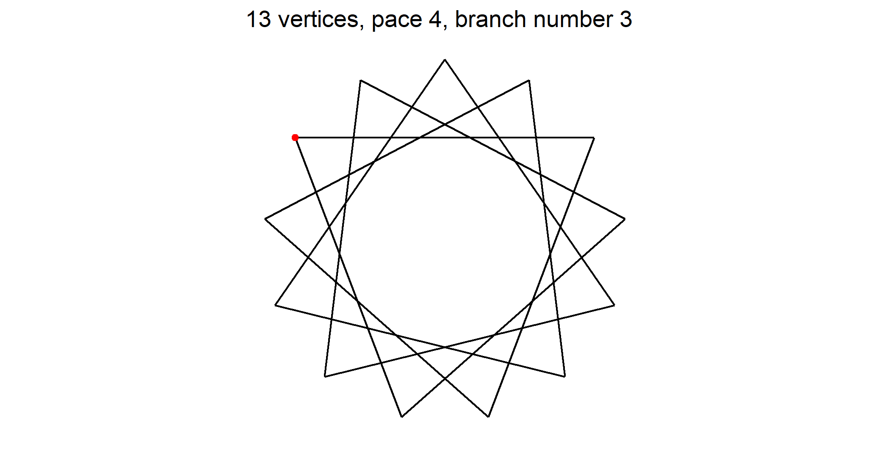
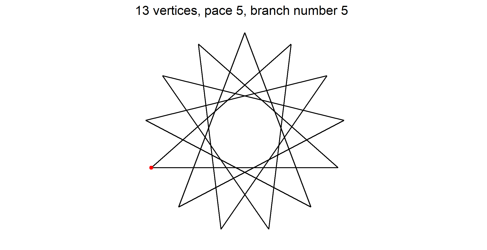

Problem statement
=================

My interest is about polygons where the number of vertices is a prime
number  higher or equal to 5. When considering only star polygons  I
wish to have a synthetic formula to compute the included circles
radiuses  without even drawing any figure.

Some mathematics first
======================

Number of polygons
------------------

For a given prime number p  the number of related p-gons is given by the
formula

*Ω*(*p*)=1 + (*p* − 1)/2

Note that all those polygons are different. Among them  only the first
one is a regular polygon. All others are star polygons  defined by the
fact that their drawing pictures implies intersections between segments.

Drawing polygons
----------------

From the same set of p starting points on the unit circle  we can draw
*Ω*(*p*) p-gons  and each of them is unique. An easy way to draw them is
to set a rule that allows to skip *k* points on each segment.

The regular polygon is of pace 1  and ties vertex \#1 to vertex \#2 
and then vertex \#2 to vertex \#3 and so on.

The first star polygon is of pace 2  and ties vertex \#1 to vertex
\#3  and then vertex \#3 to vertex \#5 and so on.

Each segment ties two and only two points of the unit circle. The pace
has following properties

1.  1 ≤ *ρ* ≤ *Ω*(*p*)
2.  When pace *ρ* = 1  the resulting draw is the regular polygon.
3.  When pace *ρ* &gt; 1  the resulting draw is a star polygon.

Let's see an example  for a the case where *p* = 13. Here  *Ω* = 6. So 
there are one regular pentagon and five star pentagons. Here they are

Red dot on a regular polygon shows point numbered 1  that is the
starting point we index other points from. As it exists a vertical axis
symmetry  you may number clockwise or counter clockwise. On figures  I
took the choice to number counter clockwise
<cite class='comment'>(mathematical way)</cite>.

Two more complex examples. First  about 17-gons  second about 89-gons.

<video width="45%" controls>
<source src="../images/maths/polygons/video/17-gon.mp4" type="video/mp4">
</video>
<video width="45%" controls>
<source src="../images/maths/polygons/video/89-gon.mp4" type="video/mp4">
</video>

A special suite
===============

Its definition
--------------

Let's consider following suite  named *ν*(*ρ*  *p*) where p is the
chosen prime  and *ρ* the pace of the star polygon. Suite *ν* takes
values in ℕ for each parameter  and gives back values in ℕ.

1.  The length *λ* of the suite *ν*(*ρ*  *p*) is
    *λ*(*p*)=⌊(*p* − 1)/2⌋−1
2.  *ν*(2  *p*)=2  the first term is the pace of the first star polygon 
    i.e. 2 
3.  *ν*(3  *p*)=(*p* − 1)/2
4.  *ν*(*n* + 2  *p*)=*ν*(*n*  *p*)+1  when n is even
5.  *ν*(*n* + 2  *p*)=*ν*(*n*  *p*)−1  when n is odd
6.  Last term *η* is
    *η* = (*ν*(2  *p*)+*ν*(3  *p*))/2 = (2 + (*p* − 1)/2)/2 = (*p* + 3)/4

Some instances of *ν*
---------------------

prime | *ν* | *λ*
:----:|:--------------------------------------------------------|:------
5 | 2 | 1
7 | 2 3 | 2
11| 2 5 3 4 | 4
13| 2 6 3 5 4 | 5
17|2 8 3 7 4 6 5 | 7
19|2 9 3 8 4 7 5 6 | 8
23|2 11 3 10 4 9 5 8 6 7 | 10
29|2 14 3 13 4 12 5 11 6 10 7 9 8 | 13
31|2 15 3 14 4 13 5 12 6 11 7 10 8 9 | 14
37|2 18 3 17 4 16 5 15 6 14 7 13 8 12 9 11 10 | 17
41|2 20 3 19 4 18 5 17 6 16 7 15 8 14 9 13 10 12 11 | 19
43|2 21 3 20 4 19 5 18 6 17 7 16 8 15 9 14 10 13 11 12 | 20
47|2 23 3 22 4 21 5 20 6 19 7 18 8 17 9 16 10 15 11 14 12 13 | 22
51|2 26 3 25 4 24 5 23 6 22 7 21 8 20 9 19 10 18 11 17 12 16 13 15 14 |25

The suite seems to oscillate from highest span to lowest span until span
vanishes
<cite class='comment'>(*δ* = *ν*(*n*  *p*)−*ν*(*n* + 1  *p*)=1)</cite>.
To see it  focus on the red dots of star polygons in movies above.

Solution of the stated problem
==============================

Let's name *ϕ* the function that computes the included circles radiuses 
given the pace *ρ* as parameter 

*ϕ*(*ρ*) = \|sin(pi/2 + (*ν*(*ρ*, p) - 1) * 2 * pi /p)\|

Some instances of *ϕ*
---------------------

prime | *ν*  | *ϕ* 
:----:|:----------------------------|:---------------------------------------------
5 | 2 | 0.309016994374948
7 | 2 3 | 0.623489801858734 0.222520933956314
11| 2 5 3 4 | 0.841253532831181 0.654860733945285 0.415415013001886 0.142314838273285
13| 2 6 3 5 4 | 0.88545602565321 0.748510748171101 0.568064746731156 0.354604887042536 0.120536680255323
17|2 8 3 7 4 6 5 | 0.932472229404356 0.850217135729614 0.739008917220659 0.602634636379256 0.445738355776538 0.273662990072083 0.0922683594633018
19|2 9 3 8 4 7 5 6 | 0.945817241700635 0.879473751206489 0.789140509396394 0.677281571625741 0.546948158122427 0.40169542465297 0.245485487140799 0.0825793454723324
23|2 11 3 10 4 9 5 8 6 7 | 0.962917287347799 0.917211301505453 0.854419404546489 0.77571129070442 0.682553143218654 0.576680322114867 0.460065037731152 0.334879612170986 0.203456013052634 0.068242413364671
29|2 14 3 13 4 12 5 11 6 10 7 9 8 | 0.976620555710087 0.947653171182802 0.907575419670957 0.856857176167589 0.796093065705644 0.725995491923131 0.647386284781828 0.561187065362382 0.46840844069979 0.370138155339914 0.267528338529221 0.161781996552764 0.0541389085854179
31|2 15 3 14 4 13 5 12 6 11 7 10 8 9 | 0.979529941252494 0.954139256400049 0.918957811620231 0.874346616144582 0.820763441207276 0.758758122692791 0.688966919075687 0.612105982547662 0.528964010326963 0.440394151557634 0.347305252844821 0.25065253225872 0.151427777504577 0.0506491688387124
37|2 18 3 17 4 16 5 15 6 14 7 13 8 12 9 11 10 | 0.985615910347708 0.967732946933499 0.942877445461084 0.911228490388136 0.873014113161188 0.828509649243842 0.77803575431844 0.721956093954524 0.660674723390081 0.594633176304287 0.524307283557232 0.450203744817673 0.372856477780309 0.29282277127655 0.210679269995726 0.127017819746879 0.0424412031961485
41|2 20 3 19 4 18 5 17 6 16 7 15 8 14 9 13 10 12 11 | 0.988280423780349 0.973695423877779 0.953396392054931 0.927502451102095 0.896165556961056 0.859569606987201 0.817929360766718 0.771489179821943 0.720521593600787 0.665325700165565 0.606225410966638 0.543567550001221 0.477719818512263 0.40906863717134 0.338016878408503 0.264981502196661 0.190391109164668 0.1146834253984 0.0383027336900356
43|2 21 3 20 4 19 5 18 6 17 7 16 8 15 9 14 10 13 11 12 | 0.98934336807511 0.976075877555927 0.957600599908406 0.934016108732548 0.905448237493147 0.872049408143808 0.833997817889878 0.791496488429254 0.744772182743782 0.694074195220634 0.639673021558891 0.581858915557953 0.52094034048793 0.457242323304638 0.391104720490156 0.322880404771446 0.252933382391681 0.181636850979436 0.109371208377875 0.0365220230576584]
47|2 23 3 22 4 21 5 20 6 19 7 18 8 17 9 16 10 15 11 14 12 13 | 0.98934336807511 0.976075877555927 0.957600599908406 0.934016108732548 0.905448237493147 0.872049408143808 0.833997817889878 0.791496488429254 0.744772182743782 0.694074195220634 0.639673021558891 0.581858915557953 0.52094034048793 0.457242323304638 0.391104720490156 0.322880404771446 0.252933382391681 0.181636850979436 0.109371208377875 0.0365220230576584
51|2 26 3 25 4 24 5 23 6 22 7 21 8 20 9 19 10 18 11 17 12 16 13 15 14 |0.99107748815478 0.979961705036587 0.964469175054377 0.944669091607919 0.920649886676429 0.892518835859881 0.860401579260139 0.82444156034176 0.784799385278661 0.741652105647957 0.695192427674642 0.645627851558802 0.593179744729355 0.538082353163373 0.480581755186684 0.420934762428335 0.359407772837513 0.296275580885634 0.231820150267529 0.16632935458313 0.100095691624099 0.0334149770076742] [0.992981096013517 0.984230577947597 0.972022914080411 0.956400984276522 0.937419661134121 0.915145617243018 0.889657090994747 0.861043611767355 0.829405685450202 0.794854441413353 0.75751124216162 0.717507257044331 0.674983001518211 0.630087843581711 0.582979479114472 0.533823377964791 0.482792202730745 0.430065202276521 0.375827582114238 0.320269853862838 0.263587166069068 0.205978618741098 0.147646564002482 0.0887958953229347 0.0296333278225597

Note  as expected  included circles radiuses are in descending order.
