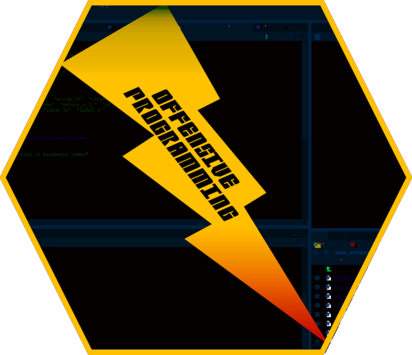

Package **wyz.code.offensiveProgramming** version **1.1.12** is available on CRAN.

If you are interested in reducing time and efforts to implement and debug R code, to generate R documentation, to generate test code, then you may consider using this package. It provides tools to manage

1.  semantic naming of function parameter arguments
2.  function return type
3.  functional test cases

Using this package you will be able to verify types of arguments passed to functions **without** implementing verification code into your function, thus reducing their size and your implementation time. Type and length of each parameter are verified on your explicit demand, allowing use at any stage of the software delivery life cycle.

Similarly, expected function returned types can also be verified on demand, either interactively or programmatically.

Browse [on-line documentation](https://neonira.github.io/offensiveProgrammingBook/) to know more.

More to come on how to put that in action on next post.
