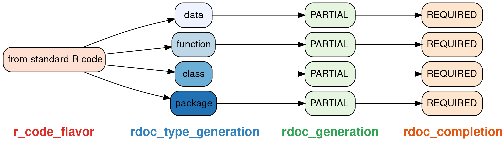
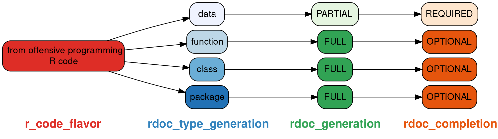

<link rel="stylesheet" href="/assets/css/my-styles.css">


Last post [**‘Still hand-crafting your Rdoc
files?’**](https://neonira.github.io/rm-r-rdoc1) introduced package
<cite class="itb">wyz.code.rdoc</cite> to produce
<cite class="itb">R</cite> documentation file in a possibly fully
automated way. Let’s see today, which production strategy will offer you
the most powerful and productive way to produce those
<cite class="itb">R</cite> documentation files.

Available weapons
-----------------

Remember that package <cite class="itb">wyz.code.rdoc</cite> aims to
generate documentation from code, **by code**. It provides many weapons
to do so, and let’s review here the most important ones

1.  The <cite class="it">ProcessingContext</cite> class allows you to
    define two type of actions to modify documentation content
    1.  An <cite class="itb">extraneous</cite> action to add on-demand
        extraneous sections into generated documentation
    2.  A <cite class="itb">post processing</cite> action to
        replace/adapt documentation content as you desire
2.  The <cite class="it">shortcuts</cite> class allows you to reuse most
    common presentation content in your documentation
3.  The <cite class="it">beautify</cite> class allows you to beautify
    the presentation of your content

To know more about options, signatures, and arguments, use

``` r
help(package = 'wyz.code.rdoc')
vignette(package = 'wyz.code.rdoc')
```

Qualify your need
-----------------

Prior executing any <cite class="itb">R</cite> documentation file
production, you have to decide your playground. Answering following
questions is helpful to do so

**Should the documentation file be regenerated on demand?**<br/> If you
want to have documentation along your code while creating the package
the answer is probably positive. If you want to defer documentation
production to the last time prior package delivery, the answer is
probably no. In both cases, go for fully automated
<cite class="itb">R</cite> documentation file production. In first case,
avoid any hand-crafting produced files, in second case, you are free to
do so.

**Will you spend time to polish manually produced files?**<br/> While
you should generally avoid hand touch-ups, sometimes a short and
efficient edition of the file can be preferred to a longer and possibly
tricky processing to get to the desired result.

For example, when checking a <cite class="itb">R</cite> package, there
are checks related to the length of documentation lines. Fixing this
manually or by a <cite class="itb">post processing</cite> action is up
to your choice. But time required in each way, could possibly be very
different. If you seek for immediate high productivity, choose wisely.
There is no way to decide out of context which tactic is the best for
your case.

**Do your package code have a lot of identical function parameter
names?**<br/> If this is the case, then structuring reusable parts will
allow you to earn a lot of time while generating all documentations of
your <cite class="itb">R</cite> package, while ensuring greater
consistency. Package <cite class="itb">wyz.code.rdoc</cite> is very
helpful in such case.

Industrial way to produce documentation
---------------------------------------

You have to know that <cite class="itb">wyz.code.rdoc</cite> manual page
production depends upon

1.  the kind of documentation you want to generate:
2.  your <cite class="itb">R</cite> code flavor

Documentation kinds are standard, and relate to destination of the
manual page: <cite class="op">function</cite>,
<cite class="op">class</cite>, <cite class="op">package</cite>, or
<cite class="op">data</cite>. When you produce one of those manual page
kinds, you have to comply with a different set of requirements in
section presence, section content, and very probably also on section
presentation.

Your <cite class="itb">R</cite> code flavor also impacts the volume of
work you will have to achieve to get a correctly filled in manual page,
well formatted, consistent with other manual pages from your package,
and easy to read. Either your code is <cite class="itb">standard R
code</cite> or it is <cite class="itb">offensive programming R
code</cite>.

### From standard R code to manual page



Manual pages generation is <cite class="ea">partial</cite>, and you will
have to provide <cite class="itb">extraneous</cite> and
<cite class="itb">post processing</cite> actions to generate their
content. If you don’t do so, each generated manual page remains
incomplete and **won’t pass package tests**. That’s why, documentation
completion is <cite class="ea">required</cite>.

Considering a <cite class="op">function</cite> or
<cite class="op">class</cite> manual page, you have to provide content
for sections <cite class="bj">examples</cite> and
<cite class="bj">description</cite>, at the very least. You also
probably need to provide content for section
<cite class="bj">details</cite> and <cite class="bj">values</cite>.

Considering a <cite class="op">package</cite> manual page, you have to
provide content for sections <cite class="bj">description</cite> and
probably content for section <cite class="bj">details</cite>.

Considering a <cite class="op">data</cite> manual page, you have to
provide content, at least for sections <cite class="bj">format</cite>
and <cite class="bj">source</cite>.

### From offensive programming R code to manual page

Using <cite class="itb">offensive programming R code</cite> eases
greatly manual pages production. As, this is based on argument semantic
naming, many fields content are generated from code without extra burden
for you, thus allowing to fulfill documentation section requirements
without any extraneous information.

1.  parameter description is inferred from semantic parameter name, and
    generally do not require any change. As this applies to each
    argument of each function of your package, such a feature is a great
    benefit and allows to earn a lot of time,  
2.  description is inferred from class and function offensive
    programming naming scheme. If you respected its
    <cite class="op">strict</cite> mode, expect produced content to be
    sharp and finalized <cite class='comment'>no modification
    required</cite>. If you don’t, you will probably need to perfect its
    content, by a <cite class="op">post processing</cite> action or some
    hand touch-ups.



Manual pages generation is <cite class="ea">full</cite> except for
<cite class="op">data</cite> where you do have to provide content, as
described above. In all other cases, generated manual pages are complete
and ready for human preview and review.

Choose the best strategy according to your case
-----------------------------------------------

First, whatever your <cite class="itb">R code flavor</cite>, a good
documentation requires <cite class="ea">examples</cite>. That’s probably
the most important part of your documentation, polish it. I already
shown on previous post, how easy it is to declare such information, to
generate a manual page.

Working under <cite class="itb">standard R code</cite>, supply
<cite class="op">extraneous</cite> and <cite class="op">post
processing</cite> information in
<cite class="it">ProductionContext</cite> definition, prior generation,
in order to comply with requirements related to the the kind of
generated manual page. Doing so, will allow production of immediately
compliant manual pages.

Using <cite class="itb">offensive programming R code</cite>, just think
to supply <cite class="op">extraneous</cite> information in
<cite class="it">ProductionContext</cite> definition, prior generation,
in order to comply with requirements related to the the kind of
generated manual page.

Next post
---------

We have seen that <cite class="itb">wyz.code.rdoc</cite> package allows
fully automated and reproducible <cite class="itb">R</cite> manual page
production. It helps enforcing the required/desired level of consistency
for your <cite class="itb">R</cite> documentation files in your
packages.

Not mentioned previously but quite obvious, using
<cite class="itb">wyz.code.rdoc</cite> eases incremental documentation
generation. When creating a package, the workflow is generally create
and debug code, then create test, then create documentation.

With <cite class="itb">wyz.code.rdoc</cite>, you can adopt a
domain-driven approach that is, create domain examples, implement and
debug code, generate documentation based on domain examples, create
tests reusing in priority domain examples. That way, the code generation
process is really incremental and domain-driven.

On small size packages, this does not make a significant difference, but
and large size packages, this eases a lot the production, especially
when many programmers are working on the same package. Documentation can
be generated automatically or on-demand at the same time the code is
delivered, thus increasing visibility and immediate reuse.

If you seek for higher collaboration and shorter tunnel effect, going
for incremental deliveries of package functionalities is powerful and
<cite class="itb">wyz.code.rdoc</cite> automates documentation
production activities to sustain your productivity.

Next post will provide <cite class="itb">wyz.code.rdoc</cite> tips and
tricks worth to know to get productive documentation generation.

Top photo: <a class='src' href="https://www.freepik.com/free-photos-vectors/business">Business
photo created by yanalya - freepik.com</a>
