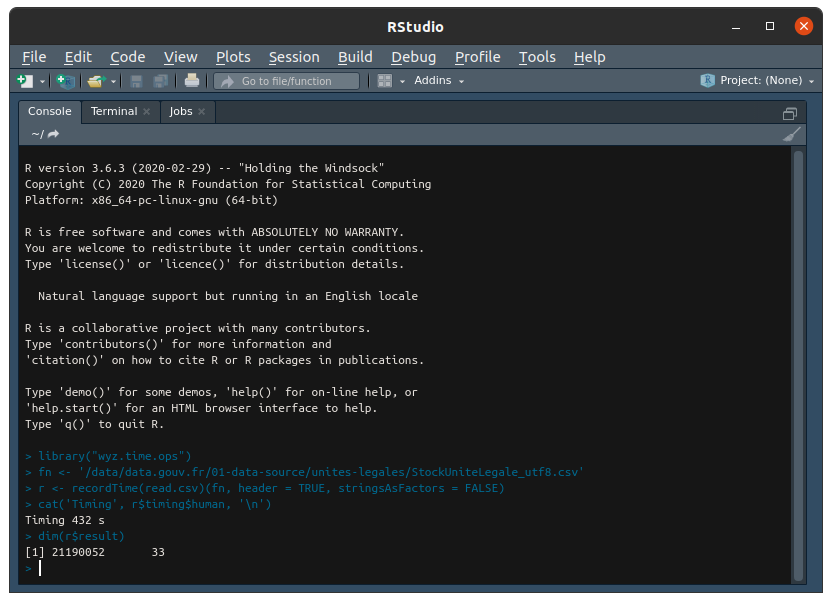

<link rel="stylesheet" href="/assets/css/my-styles.css">

I had to ingest some medium to high volume data from official French government sites,
and would like to share my return on experience. Data ingestion here is 
solved globally, without any other consideration than
maximum reduced time for implementation, result reproducibility and raw speed. 

Data can be downloaded from following open data French official 
site <a href='https://www.data.gouv.fr/fr/datasets/base-sirene-des-entreprises-et-de-leurs-etablissements-siren-siret'>www.data.gouv.fr</a>. 

For information and demonstration purpose, I will just focus on 
the two following files. 

 number of lines | number of columns | size in bytes | filename
 :------------:|:----------------:|:----------------:|:------------------------
  21_190_053 | 33 | 2_723_590_237 | StockUniteLegale_utf8.csv
  29_818_083 | 48 | 5_224_371_093 | StockEtablissement_utf8.csv


I wonder if <cite class="itb">R</cite> will be able to handle
those files directly without any data chuncking or 
other file transformations prior to ingest data. 

Typical <cite class="itb">R</cite> CLI sequence will be

``` r
library('wyz.time.ops')
fn <- '/data/data.gouv.fr/01-data-source/unites-legales/StockUniteLegale_utf8.csv'
r <- recordTime(read.csv)(fn, header = TRUE, stringsAsFactors = FALSE)
cat('Timing', r$timing$human, '\n')
```

My expectations
-----------------

Frankly, I am doubtful of <cite class="itb">R</cite> ability to 
handle correctly these files under such a direct approach. I expect many 
causes of fatal error may occur and stop the processing
prior its normal ending: memory error, stack overflow, read error, ... 

All trials are executed with <cite class="itb">R 3.6.3</cite> on a
**single Linux machine** with following configuration


Let's proceed to some trials and see what happens. 


File StockUniteLegale_utf8.csv
-----------------



It works!! Very surprised indeed. Was expecting error and much longer 
time to get a result. Here velocity exceed 49000 lines per seconds. 

Replaying same test on identical conditions, fresh start of 
<cite class="itb">R studio</cite>, same libraries and options loaded,
and same machine conditions, I got some variability in time results,
ranging from 403 to 498 seconds. Velocity is therefore very variable,
and I have no clear and reliable idea of main causes for such behavior 
<cite class="comment">garbage collection?</cite>. 

File StockEtablissement_utf8.csv
-----------------

This file is nearly twice as large as previous one. Results are mixed. 
It sometimes leads to a result and sometime to a failure 
<cite class="comment">R session aborption</cite>. I have not been able
to identify root cause of such deviance. 

Best performance achieved is 706 seconds, that is a velocity of more than
42000 lines per second, comparable to performance of some trials for previous 
file. 


Results
-----------------

I was expecting failure in both cases, and got partial failure on second case 
only, and its root cause is not clearly identified. 

Globally, quite impressed by the results, as I was clearly not expecting such 
processing velocity level with this very direct and straightforward approach. 

As a rule of thumb, 40000 lines per second is a useful metric to know to forecast
time for CSV data ingestion. 

<cite class="itb">R</cite> is impressive!

