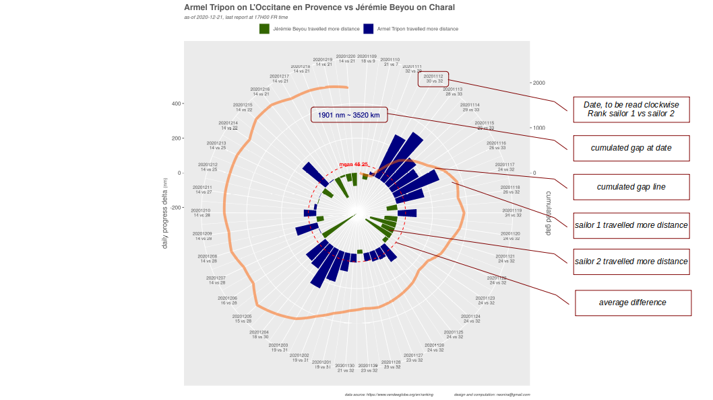
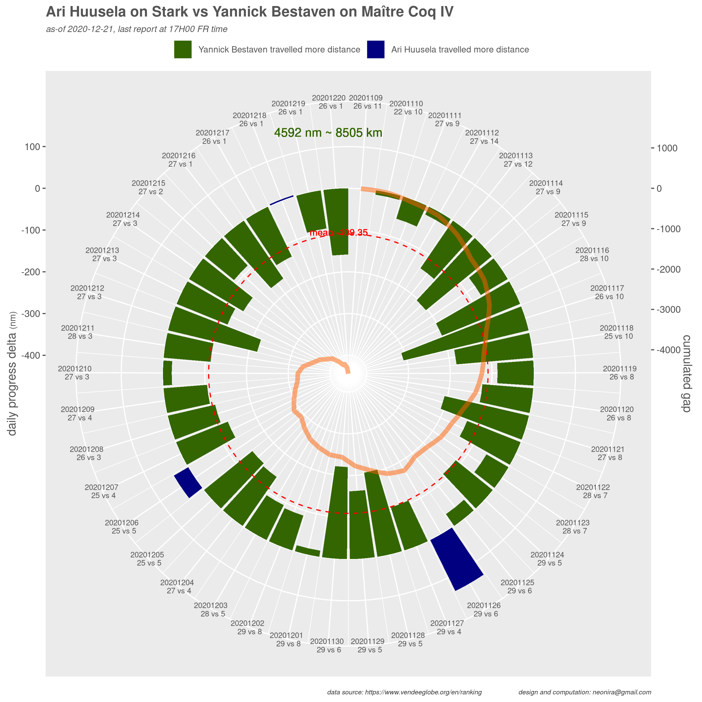
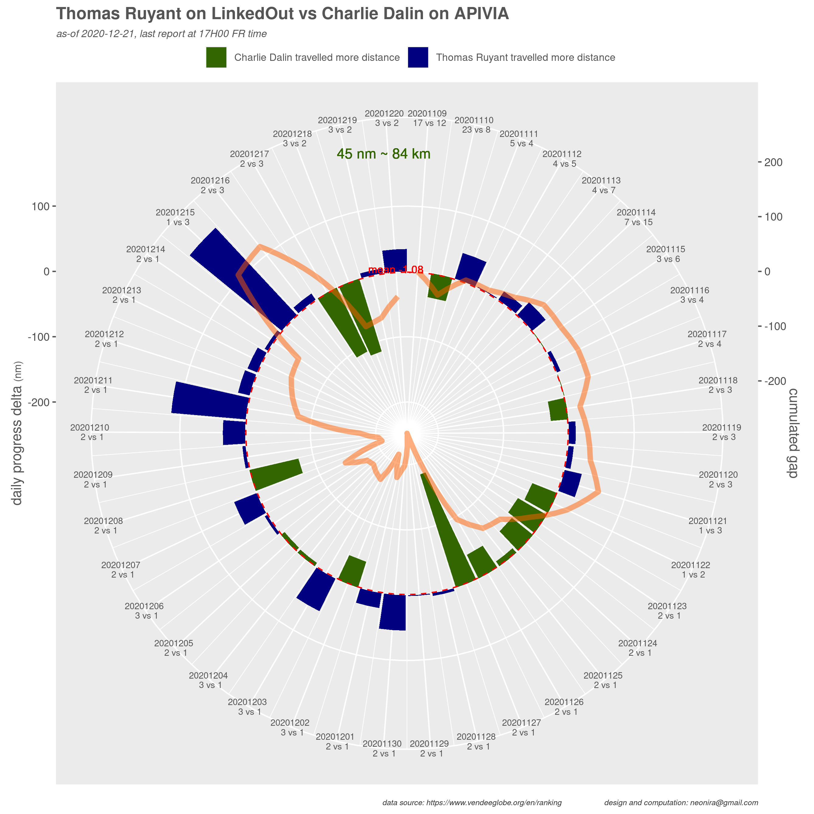
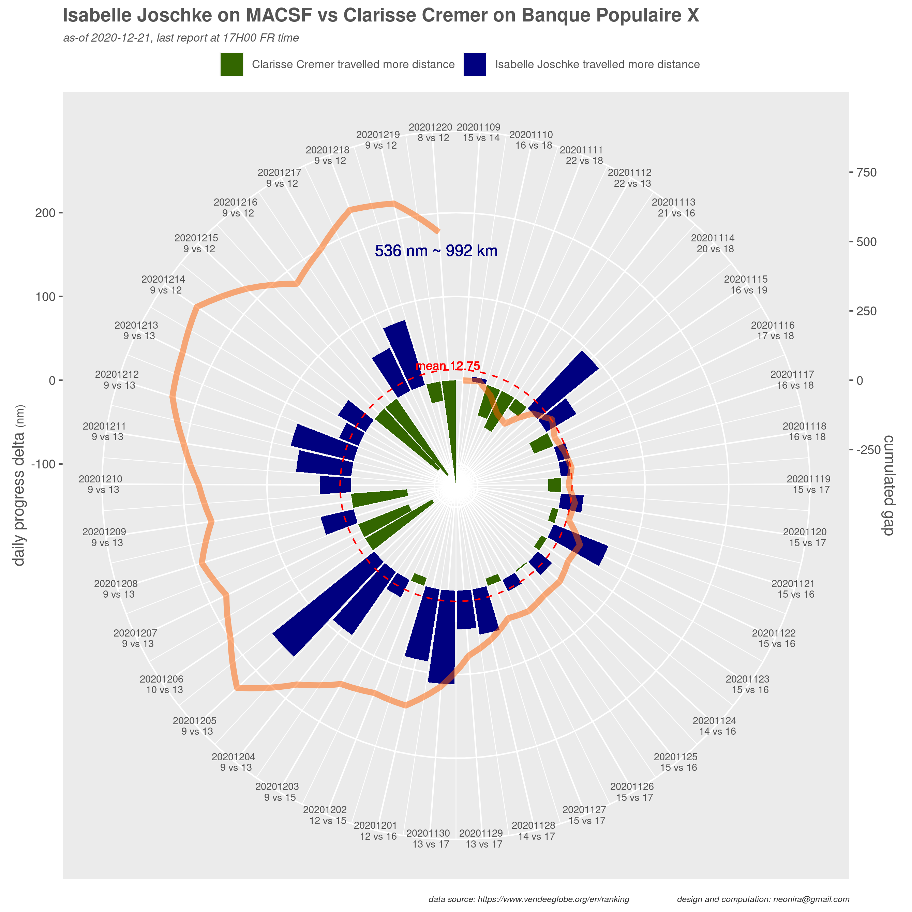
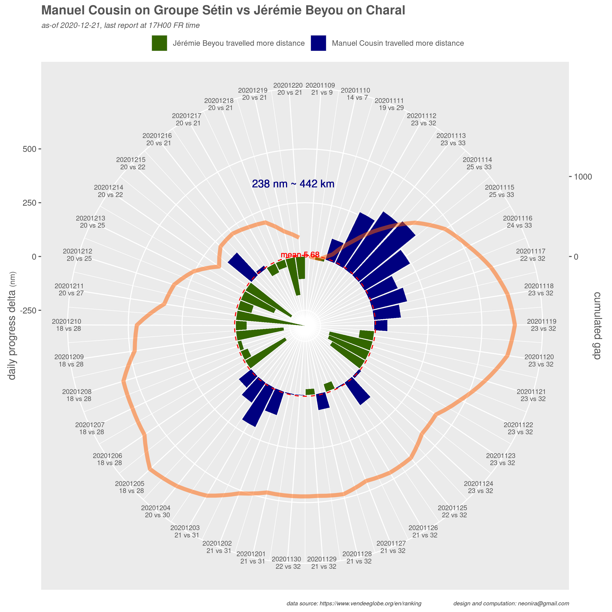
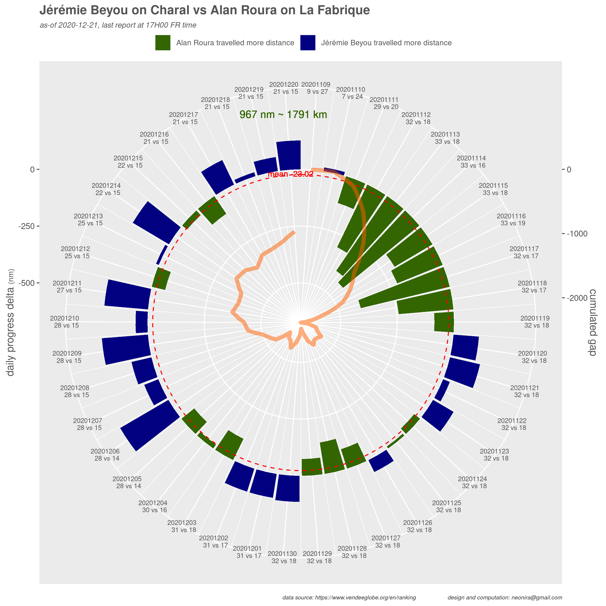
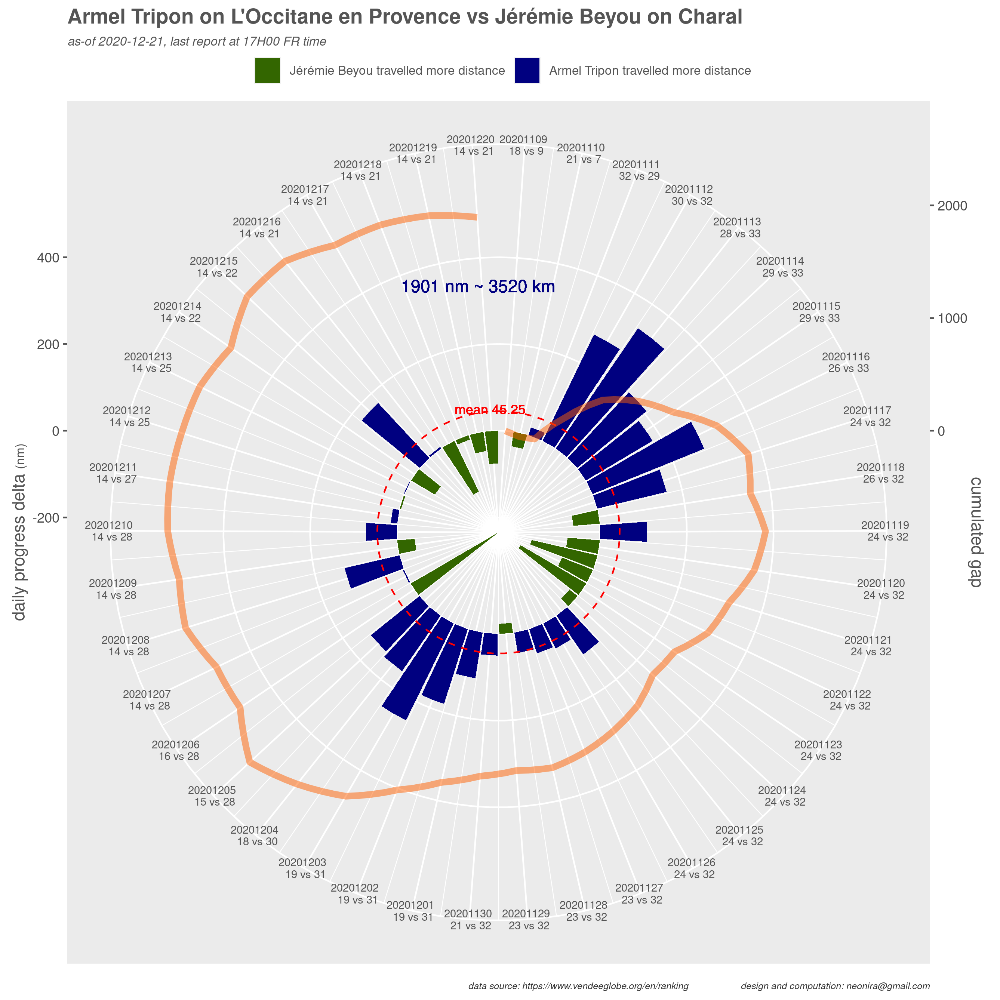

<link rel="stylesheet" href="../assets/css/style.css">

I was asked to answer questions about how to show skipper's Vendée Globe race progress, especially when comparing far apart skippers. 

Vendée Globe offical data provide distance to finish, distance to leader and last 24 hours distance travelled. As they are 6 vacations per day, a little bit of data wrangling is necessary to catch up just the right data. 

I was wondering what kind of graph should be used to get an appealing and demonstrating result. 

I ended up created a compound graph made of a polar bar graph and two polar lines, one for the mean difference and one for the cumulated gap. Here is the first result I got. 

To make it easy for anyone, here are explanations to ease reading.

Finally, I produced some graphs to compare various situations.

# The leader versus the coolest sailor 

Very great laggard, the coolest sailor Ari is indeed doing well on an old boat. Nothing comparable with current leader for sure, but Ari is gaining experience and the race is still very long to finish. 

# The great fight between Charlie and Thomas 

How near this two are is simply amazing after 40 days of race!

# Leading women 

Clearly, a good advantage to Isabelle, but nothing is played, a the current gap can be fullfilled in just one good day of navigation. 

# Will Jérèmie catch up the preceeding group ?

Jérèmie will probably catch up with Manuel. It could also get back on Alan, but to
fight with Armel, there is now a need for very favorable meteo conditions. Very unsure this will happen. 
Jérèmy is a fighter. If there is just one opportunity to do so, he will probably play it. 

