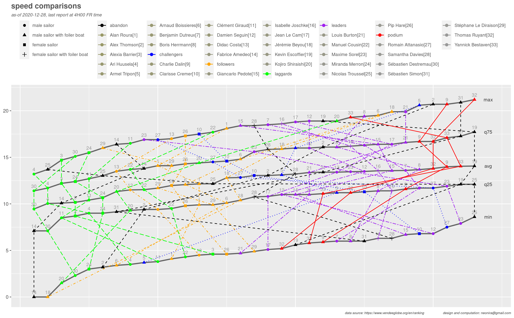
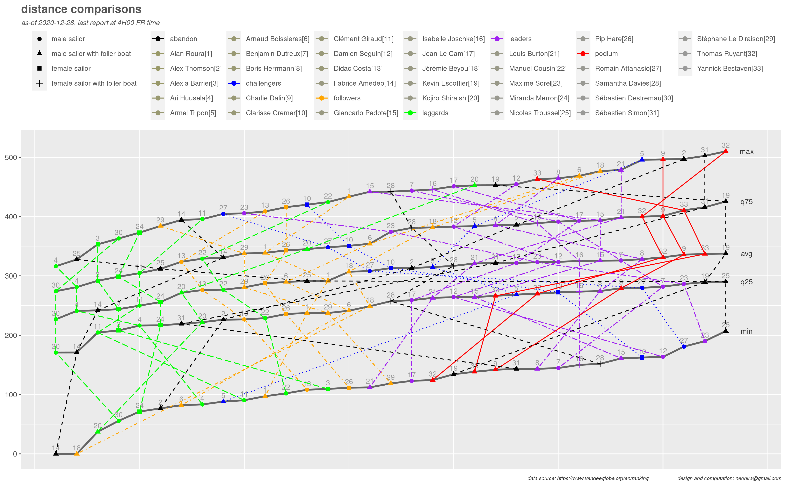
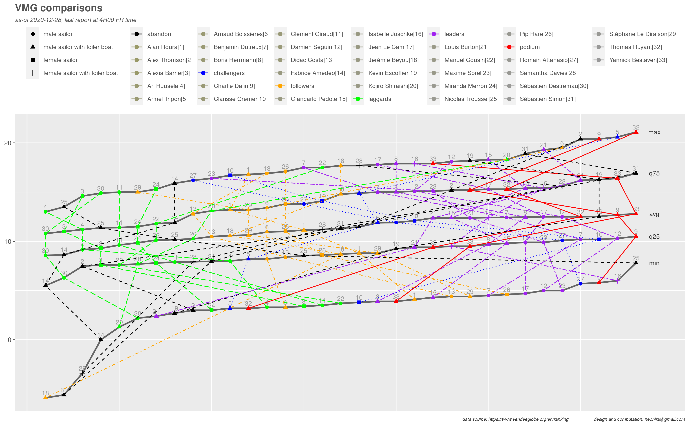

<link rel="stylesheet" href="../assets/css/style.css">

While looking at Vendée Globe data, I had the feeling of some patterns to explain why are some skippers laggards and why some others are always in the top positions. I wondered what kind of graph could be used to help confirming or disproving such feeling. 

Here are the conditions to meet

1. 33 sailors at start, and this is decreasing as the race goes on
1. sailor gender has to be considered as for now, a woman has yet never won this race
1. having a boat with foils might bring an advantage. This has to be considered
1. current race position has to be considered by group as shown on previous post [distance to finish](https://neonira.github.io/jvg2)
1. graph should be created for speed, distance and velocity made good <cite class='comment'>speed to the goal</cite>
1. data have to be extracted from Vendée Globe daily vacations <cite class='comment'>see [official ranking](https://www.vendeeglobe.org/en/ranking)</cite> and prepared to get per sailor/boat five nums series <cite class='comment'>min, q25, average, q75, max</cite>
1. data series could be incomplete due to abandon

I ended up with following results 

Creating such diagrams is more complex than it appears at first glance. 
It requires much more data wrangling than expected, and many diagram color manipulations that are rather awkward and unintuitive. 

Indeed, I am not fully satisfied of the result as I would have got a separated color legend
for sailors and race position groups. I did not succeed in finding a way to do so, 
although there might be a way. Let me know if you have one. Still wondering why there is no way
to tell explicitley [ggplot2](https://cran.r-project.org/package=ggplot2) the name of the legend to consider. This would be simpler and more convenient!

