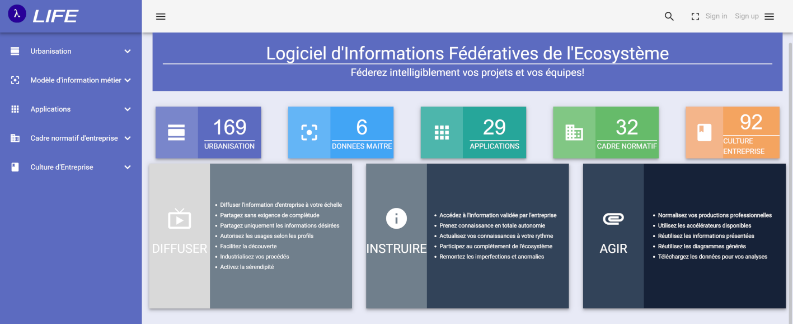

<link rel="stylesheet" href="../assets/css/style.css">

Votre entreprise possède très probablement des actifs résultant des nombreuses études d'architecture réalisées en son sein. 
Comment les partagez vous? Quelle interaction avec vos lecteur entretenez vous? Comment mesurez vous l'utilité des informations et documents exposés? Quel est le niveau de recommandation de votre solution de partage et d'exposition de ces actifs, selon le bouche à oreille interne à votre entreprise. 

La solution LIFE, vous permet d'exposer et de partager, au périmètre désiré, les thématiques suivantes

1. navigation dans la cartographie d'urbanisation
1. Calcul temps réel d'impact de transformation du système d'information   
1. Connaissance des référentiels et de leurs caractéristiques
1. Inventaire applicatif
1. Inventaire de flux applicatifs
1. Exposition du cadre normatif d'entreprise
1. Facilitation de la gestion de l'obsolescence applicative
1. Présentation de FAQ
1. Présentation de glossaires hyperliés vers les références absolues ou relatives de votre entreprise 

Télécharger la [fiche produit](../images/pdf/product-sheets/life-fiche-produit.pdf) pour en savoir plus. 

