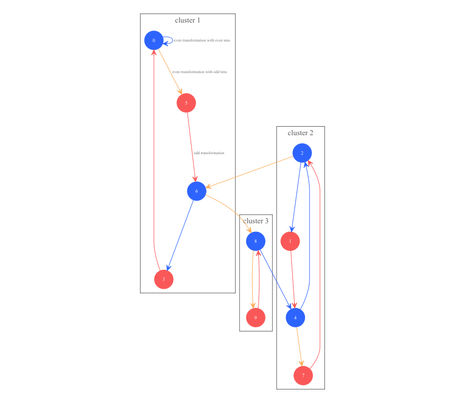

La [séquence de Collatz](https://en.wikipedia.org/wiki/Collatz_conjecture) est une suite mathématique dont la convergence n'a toujours pas été démontrée. Découvrons la, ici. 

# Quelques définitions 

Afin de faciliter la lecture, voici les conventions de nommages que j'utiliserai

La séquence de Collatz est basée sur deux calculs particuliers. Le premier s'applique aux nombres impairs, $\omega(n) = 3n + 1$ et le second aux nombres pairs $\upsilon(n) = \frac{n}{2}$.

La fonction $\omega(n)$ fournit obligatoirement un résulat pair car n est obligatoirement impair.

L'usage d'indices tel $k_r$ signifie l'application récurrente de la fonction $k$. Si l'indice est la lettre $r$ alors c'est l'expression d'une application théorique dont le nombre d'application reste à déterminer. Si l'indice est numérique entier, alors il exprime le nombre d'applications récurrentes à considérer. 

La fonction $\upsilon_r(n)$ fournit obligatoirement un résulat impair car elle s'applique récursivement tant que le résultat est pair. 

formule de la suite | premiers éléments
:----------------------|:----------------------------------------------------
$\rho_1(n) = 4n + 1$ | $\rho_1(n) = {1, 5, 9, 13, 17, 21, ...} \forall n \in \mathbb{N}$
$\rho_2(n) = 4n + 2 = \rho_1(n) + 1$ | $\rho_2(n) = {2, 6, 10, 14, 10, 22, ...}$
$\rho_3(n) = 4n + 3 = \rho_2(n) + 1$ | $\rho_3(n) = {3, 7, 11, 15, 19, 23, ...}$
$\rho_4(n) = 4(n + 1) = \rho_3(n) + 1$ | $\rho_0(n) = {4, 8, 16, 20, 24, ...}$

## propriété des fonctions

### Fonction $\omega$

$n = a + b$

$\omega(n) = 3n + 1 = 3 * (a + b) + 1 = (3 * a + 1) +  (3 * b + 1) - 1 = \omega(a) + \omega(b) -1$

### Fonction $\upsilon$

$n = a + b$

$\upsilon(n) = \frac{n}{2} = \frac{a+b}{2} = \frac{a}{2} + \frac{b}{2} = \upsilon(a) + \upsilon(b)$

## logique paritaire à connaitre

Interressons nous à $\psi(n) = a . n + b$ et tentons de déterminer la parité du résultat en fonction des coeficients $a$ et $b$

cas de parité | parité $a$ | parité $b$ | parité du résultat $\psi(n)$
:-------------|:-----------|:-----------|:-----------
1 | paire | paire | paire
2 | paire | impaire | impaire 
3 | impaire | paire | parité de $n$
4 | impaire | impaire | parité inverse de $n$

Ce qu'il est important de bien comprendre ici, c'est que la parité du résultat qui guide l'application d'une fonction ou de l'autre dans la séquence de Collatz, est en fait indépendante de la valeur de n dans la moitié des cas, qui sont identifiables par un coeficient multiplicateur $a$ pair. 

Dans les cas $1$ et $2$ la parité du résultat est identique à la parité de $b$. 

# Transmutation des digits

La séquence de Collatz transforme les chiffres unités d'une manière prédictible, car résultante des règles de l'addition et de la multiplication. Ceci conduit à la figure suivante, qui présentge de nombreux points d'intérêts, comme nous l'allons voir. 

## Points d'entrées et de sorties

Les points d'entrée et de sortie de chaque cluster sont d'un intérêt particulier. 

Pour les clusters $1$ et $3$ les points d'entrée et de sortie sont confondus, et portent respectivement sur les digits $6$ et $8$. Pout le cluster $2$, le point d'entrée est le digit $4$ et celui de sortie le digit $2$. 

Les commutations inter clusters se font donc uniquement entre digits pairs et sous les conditions suivantes

cluster de départ | cluster d'arrivée | condition de commutation
:-----------------|:-------------------|:---------------------------------------
$1$ | $3$ | dizaines impaires
$2$ | $1$ | dizaines impaires
$3$ | $2$ | dizaines paires

## Boucles

L'ensemble des transitions inter digits est sans boucle à l'exception du digit $0$. 

## Appartenance des digits

Notez que chaque digit appartient à un et un seul cluster. 

# Quelques propriétés remarquables

**Propriété 1** tout nombre $n = 2^p$ se réduit au digit $1$ par application récursive de la fonction $\upsilon$. 

**Propriété 2** tout nombre $n \le 16$ se réduit au digit $1$ car cela a été prouvé par calcul.

# Analyse systèmique globale

Tout nombre $n$ peut s'exprimer sous une des quatres formes suivantes

numéro de forme | formule de la forme
:--------------:|:------------------------------------------------------------
0 | $n = 4p$, qui est forcément pair
1 | $n = 4p + 1$, forcément impair
2 | $n = 4p + 2$, forcément pair
3 | $n = 4p + 3$, forcément impair

## Analyse de la forme $0$

La forme $0$ est paire et multiple de $4$. Sa réduction conduit au résultat suivant $\upsilon_2(4p) = p$.

Les propriétés $1$ et $2$ ont prouvé que $4$ se réduisait au digit $1$, ce qui est confirmé par l'application de cette formule car $\upsilon(\upsilon(4 \times 1)) = 1$.

### Preuve par récurrence

$\upsilon_r(4) = \upsilon_{r - 1}(2) = \upsilon_{r - 2}(1) = 1$ donc vrai pour le premier élément

Considérons la formule vraie à l'étape $n$, donc $\upsilon_r(4 \times n) = 1$ et montrons sa vérité à l'étape $n+1$. 

$\upsilon_r(4 \times (n + 1)) = \upsilon_r(\upsilon_r(4 \times n ) + \upsilon_r(4 \times 1)))$ de par la distributivité de la division et l'application récurrente de la fonction $\upsilon$.

$\upsilon_r(\upsilon_r(4 \times n ) + \upsilon_r(4 \times 1)) = \upsilon_r(\upsilon_r(4 \times n ) + \upsilon_1(4 \times 1)) = \upsilon_r(1 + 1)$ car $\upsilon_r(4 \times n) = 1$ est l'hypothèse supposée vraie en raisonnement par récurrence et la propriété $1$ prouve que $\upsilon_1(4 \times 1)) = 1$

$\upsilon_r(1 + 1) = \upsilon_r(2) = \upsilon_1(2) = 1$ 

L'hypothèse est donc confirmée vraie à l'étape $n+1$ ce qui prouve sa véracité.

### Impact

La suite numérique $\rho_4(n)$ est donc une suite où tous les éléments se réduisent au digit $1$. 

### Exemple numérique

$n = 8432$

$\upsilon_r(n) = \upsilon_r(2^4 \times 527) = \upsilon_4(2^4 \times 527) = 527$ qui se réduit au digit $1$ sans aucun calcul car $n$ est multiple de $4$. 

### Conclusion pour la forme $0$

Tout nombre entier dont le résultat modulo $4$ est $0$ est donc convergent vers le digit $1$ par application de la logique de la suite de Collatz. 

## Analyse de la forme $1$

La forme $1$ est impaire. Il convient donc d'application la fonction $\omega$, ce qui conduit au résultat suivant $\omega(4p + 1) = 3 \times (4p + 1) + 1 = 12p + 4 = 4 (3p + 1)$, qui est de la forme $0$ donc convergent vers le digit $1$. 

### Impact

La suite numérique $\rho_1(n)$ est donc une suite où tous les éléments se réduisent au digit $1$. 

### Conclusion pour la forme $1$

Tout nombre entier dont le résultat modulo $4$ est $1$ est donc convergent vers le digit $1$ par application de la logique de la suite de Collatz. 

## Analyse de la forme $3$

La forme $3$ est impaire. Il convient donc d'application la fonction $\omega$, ce qui conduit au résultat suivant $\omega(4p + 3) = 3 * (4p + 3) + 1 = 12p + 10 = 2 (6p + 5)$.

$\upsilon_r(2 (6p + 5)) = \upsilon_{r-1}(6p + 5) = 6p + 5$ car forcément impair.

$\omega(6p + 5) = 3 * (6p + 5) + 1 = 18p + 16 = 16 (p + 1) + 2p$ forcément pair.

$\upsilon_r(16 (p + 1) + 2p) = \upsilon_r(16 (p + 1)) + \upsilon_r(2p) = \upsilon_r(p+1) + \upsilon_r(p) = \upsilon_r(2p + 1)$ par application des propriété de la fonction $\upsilon$.

Si p est pair, alors $p = 2q$ et $\upsilon_r(2p + 1) = \upsilon_r(4q + 1)$ qui est de la forme 1, déjà prouvé réductrice au digit $1$.

Si p est impair, alors $p = 2q + 1$ et $\upsilon_r(2p + 1) = \upsilon_r(4q + 3)$ qui est de la forme 3. Cette forme est donc auto récurrente. 

### Impact

La suite numérique $\rho_3(n)$ est donc une suite où tous les éléments se réduisent au digit $1$. 

### Conclusion pour la forme $3$

Tout nombre entier dont le résultat modulo $4$ est $3$ est donc convergent vers le digit $1$ par application de la logique de la suite de Collatz. 

## Analyse de la forme $2$

La forme $2$ est paire. Il convient donc d'application la fonction $\upsilon$, ce qui conduit au résultat suivant $\upsilon_r(4p + 2) = \upsilon_r(2p + 1) = 2p + 1$ car $2p + 1$ est forcément impair et donc non divisible par $2$, 

$\omega(2p + 1) = 3 * (2p + 1) + 1 = 6p + 4 = 2(3p + 2)$ forcément pair

$\upsilon_r(2(3p + 2)) = \upsilon_{r - 1}(3p + 2)$

Nous passons de $\upsilon_r(4p + 2) \in \rho_2(n)$ à $\upsilon_r(3p + 2)$.

Les valeurs de $\upsilon_r(3p + 2)$ suivent une chemin d'appartenance constant aux suites $\rho_k(n)$. 

La première valeur appartient à $\rho_2(n)$, ainsi que la cinquième la neuvième, etc. Ces indexes sont donnés par la formule $\kappa_{j=1}^{+\infty}(j) = 1 + 4(j - 1)$. La forme $2$ est donc auto référente. 

La seconde valeur appartient à $\rho_1(n)$, ainsi que la sixième la dixième, etc. Ces indexes sont donnés par la formule $\kappa_{j=1}^{+\infty}(j) = 2 + 4(j - 1)$. Ces valeurs appartiennent à la forme $1$ est sont déjà prouvées convergentes. 

La troisième valeur appartient à $\rho_3(n)$, ainsi que la septième, la onzième, etc. Ces indexes sont donnés par la formule $\kappa_{j=1}^{+\infty}(j) = 3 + 4(j - 1)$. Ces valeurs appartiennent à la forme $3$ est sont déjà prouvées convergentes. 

La quatrième valeur appartient à $\rho_4(n)$, ainsi que la huitième la douzième, etc. Ces indexes sont donnés par la formule $\kappa_{j=1}^{+\infty}(j) = 4 + 4(j - 1)$. Ces valeurs appartiennent à la forme $0$ est sont déjà prouvées convergentes. 

### Impact

La suite numérique $\rho_2(n)$ est donc une suite où tous les éléments se réduisent au digit $1$. 

### Conclusion pour la forme $2$

Tout nombre entier dont le résultat modulo $4$ est $2$ est donc convergent vers le digit $1$ par application de la logique de la suite de Collatz. 

