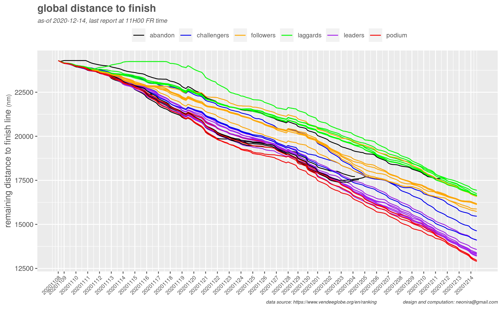

<link rel="stylesheet" href="../assets/css/style.css">

A single diagram, showing travelled distances and remaining travel to sail for the whole fleet. 

If you seek for a potential winner, look at red and purple curves. There are still eleven sailors able to win,
the ones that are currently occupying places from first to eleventh. Others are simply too far to pretend to victory, while race approaches the half distance. 

We'll see what happen. Here are my predictions from now

There will be at least 3 more abandons prior the end of the race

Meteorology in the pacific will be much easier, and foilers will show their strength. 

